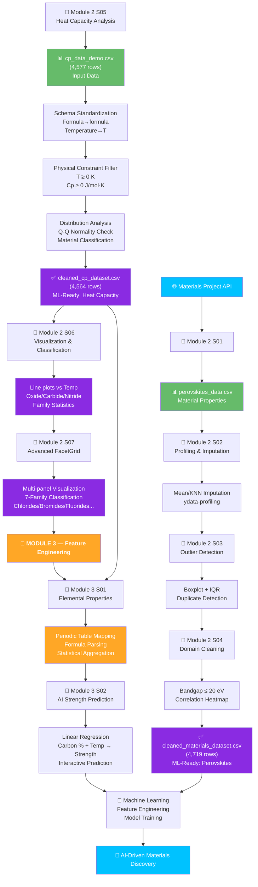

<div align="center">


<br/>

<a href="https://skillicons.dev">
  
</a>

<br/><br/>


<br/><br/>


<br/>

> 📚 Practical AI & Material Science notebooks for learning Python programming, data analysis, material properties, scientific visualization, Materials Project API, and machine-learning-ready data processing.


</div>


## 📂 Repository Structure

```text
📦 AI-Material-Science
 │
 ├── 📁 Module_1
 │   ├── 📓 Module 1 S01.ipynb
 │   ├── 📓 Module 1 S02.ipynb
 │   ├── 📓 Module 1 S03.ipynb
 │   ├── 📓 Module 1 S04.ipynb
 │   ├── 📓 Module 1 S05.ipynb
 │   ├── 📓 Module 1 S06.ipynb
 │   ├── 📓 Module 1 S07.ipynb
 │   └── 📓 Module 1 S08.ipynb
 │
 ├── 📁 Module_2
 │   │
 │   ├── 📓 Notebooks
 │   │   ├── 📓 Module 2 S01.ipynb
 │   │   ├── 📓 Module 2 S02.ipynb
 │   │   ├── 📓 Module 2 S03.ipynb
 │   │   ├── 📓 Module 2 S04.ipynb
 │   │   ├── 📓 Module 2 S05.ipynb
 │   │   ├── 📓 Module 2 S06.ipynb
 │   │   └── 📓 Module 2 S07.ipynb
 │   │
 │   ├── 📊 Data
 │       │
 │       ├── 🔵 Perovskite Materials Data (S01-S04)
 │       │   ├── 📊 perovskites_data.csv
 │       │   ├── 📊 cleaned_materials_dataset.csv
 │       │   └── 📄 perovskites_report.html
 │       │
 │       └── 🟣 Heat Capacity Data (S05-S07)
 │           ├── 📊 cp_data_demo.csv (Input)
 │           └── 📊 cleaned_cp_dataset.csv (Output)
 │
 └── 📁 Module_3
     │
     ├── 📓 Notebooks
     │   ├── 📓 Module 3 S01.ipynb
     │   ├── 📓 Module 3 S02.ipynb
     │   ├── 📓 Module 3 S03.ipynb
     │   ├── 📓 Module 3 S04.ipynb
     │   └── 📓 Module 3 S05.ipynb
     │
     ├── 📊 Data
         │
         ├── 🟠 Elemental Features & ML Preparation (S01)
         │   ├── 📊 cleaned_cp_dataset.csv (Input)
         │   ├── 📊 elemental_feature_vectors.csv (Output)
         │   └── 📊 materials_feature_matrix.csv (Output)
         │
         ├── 🟠 CBFV Featurization, Magpie Properties (S03-S04)
         │   ├── 📊 cleaned_cp_dataset.csv (Input)
         │   └── 📊 cbfv_features.xls / cbfv_features.csv (Output — 4,564 rows × 133 cols)
         │
         └── 🟠 Matminer Featurization, Magpie & Deml (S05)
             ├── 📊 cleaned_cp_dataset.csv (Input)
             ├── 📊 matminer_magpie_features.csv (Output — 4,564 rows × 133 cols)
             └── 📊 matminer_deml_features.csv (Output — 4,564 rows × 81 cols)
 │   
 │
 └── 📄 README.md
```


## 📘 Notebook Overview

<div align="center">


# 🔵 Module 1 — Python & Material Science Fundamentals


</div>

<details open>
<summary><b>📓 Module 1 S01.ipynb — 🏗️ Material Properties using Python</b></summary>
<br>


      


 Learn how to organize engineering material data using Python dictionaries.
</details>

<details>
<summary><b>📓 Module 1 S02.ipynb — 📊 Material Data Processing</b></summary>
<br>


     


 Understand numerical computing techniques used in Material Science.
</details>

<details>
<summary><b>📓 Module 1 S03.ipynb — 📈 Periodic Table Visualization</b></summary>
<br>


    


 Visualize engineering datasets with professional graphs.
</details>

<details>
<summary><b>📓 Module 1 S04.ipynb — 🔥 Thermal Conductivity Analysis</b></summary>
<br>


   


 Compare thermal properties of different engineering materials visually.
</details>

<details>
<summary><b>📓 Module 1 S05.ipynb — 📋 Multi-Material Dataset</b></summary>
<br>


   


 Build and analyze structured material datasets.
</details>

<details>
<summary><b>📓 Module 1 S06.ipynb — 🤖 AI Workflow & Git Basics</b></summary>
<br>


    


 Learn professional project management using Git with AI notebooks.
</details>

<details>
<summary><b>📓 Module 1 S07.ipynb — 🔑 Materials Project API Setup</b></summary>
<br>


    


 Learn how to configure and connect Python applications to the Materials Project API.
</details>

<details>
<summary><b>📓 Module 1 S08.ipynb — 🔥 Materials Data Retrieval and Visualization</b></summary>
<br>


   


 Learn how to retrieve materials data from the Materials Project API and visualize it using Python.
</details>

<br>

<div align="center">


# 🟣 Module 2 — Materials Data Engineering & Analysis


</div>

<details open>
<summary><b>📓 Module 2 S01.ipynb — 🔬 Materials Project Data Retrieval & Dataset Creation</b></summary>
<br>


         

The notebook retrieves materials matching the required chemical formulas from the Materials Project and extracts properties including **Material ID, formula, band gap, formation energy per atom, and volume**.

The retrieved datasets are converted into Pandas DataFrames, merged using `Material_ID`, and exported as `perovskites_data.csv`.


 Learn how to retrieve real materials-science data from the Materials Project API.
 Understand how to convert API results into structured Pandas DataFrames.
 Learn how to merge material-property datasets.
 Create a reusable CSV dataset for further AI and machine-learning analysis.

**📊 Datasets Used & Generated:**
- 📥 **Input:** Materials Project API (via MPRester)
- 📤 **Output:** `perovskites_data.csv` (merged material properties)

| Column             | Description                           |
| ------------------ | -------------------------------------- |
| `Material_ID`      | Materials Project material identifier |
| `Formula`          | Chemical formula                      |
| `Bandgap`          | Band gap value (eV)                   |
| `Formation_Energy` | Formation energy per atom (eV/atom)   |
| `Volume`           | Material volume (Ų)                   |
</details>

<details>
<summary><b>📓 Module 2 S02.ipynb — 🧹 Materials Dataset Profiling & Missing Value Imputation</b></summary>
<br>


        

The notebook loads the `perovskites_data.csv` dataset generated in Session 09 and displays the first records, then creates an automated profiling report saved as `perovskites_report.html`.

```text
Mean Imputation  →  SimpleImputer(strategy="mean")
KNN Imputation   →  KNNImputer(n_neighbors=5)
```

Both approaches are applied to the `Bandgap` column.


 Inspect a scientific dataset automatically.
 Generate an HTML data-profiling report.
 Understand missing-value problems in material datasets.
 Apply Mean Imputation and KNN Imputation.
 Prepare datasets for future machine-learning workflows.

**📄 Report Generated:** `perovskites_report.html`
</details>

<details>
<summary><b>📓 Module 2 S03.ipynb — 🧪 Duplicate & Outlier Detection in Materials Data</b></summary>
<br>


      

The notebook (Session 11) reloads the cleaned `perovskites_data.csv` dataset and inspects it for data-quality issues.

It first detects **duplicate entries** based on the `Formula` column using `df.duplicated()`, then visualizes the distribution of the `Bandgap` column with a **Seaborn boxplot** to spot anomalies visually. Finally, it applies the **IQR method** — computing Q1, Q3, and IQR — to mathematically flag statistical outliers in `Bandgap`.

```text
Duplicate Detection (Formula) → Boxplot (Bandgap) → IQR Bounds → Flagged Outliers
```


 Detect duplicate records in a materials dataset.
 Visualize numerical distributions using Seaborn boxplots.
 Understand and apply the IQR method for outlier detection.
 Combine visual and statistical techniques for data-quality assessment.
</details>

<details>
<summary><b>📓 Module 2 S04.ipynb — 📉 Domain-Driven Cleaning & Correlation Analysis</b></summary>
<br>


      

The notebook (Session 12) reloads `perovskites_data.csv` and applies **domain-driven cleaning**, filtering out physically implausible band gap values (> 20 eV) to produce a cleaned `df_clean`. It then selects numeric columns (`Bandgap`, `Formation_Energy`, `Volume`) and generates a **correlation heatmap** with Seaborn. The finalized dataset is exported as `cleaned_materials_dataset.csv`.

```text
perovskites_data.csv 
  ↓ (S02-S03: Profiling, Imputation, Outlier Detection)
  ↓ (S04: Domain Cleaning - Bandgap ≤ 20 eV)
  ↓ (Correlation Analysis)
cleaned_materials_dataset.csv ✅
```


 Apply domain knowledge to filter physically implausible data.
 Build a cleaned, analysis-ready DataFrame (`df_clean`).
 Generate and interpret a correlation heatmap of materials properties.
 Understand relationships between band gap, formation energy, and volume.
 Export finalized ML-ready dataset to `cleaned_materials_dataset.xls`.

**📊 Dataset Generated:** `cleaned_materials_dataset.xls` (4,719 rows, 5 columns)
</details>

<details open>
<summary><b>📓 Module 2 S05.ipynb — 🌡️ Heat Capacity (Cp) Dataset Cleaning & Analysis</b></summary>
<br>


          

The notebook loads `cp_data_demo.csv` (4,577 rows) containing heat capacity measurements across different materials and temperatures. It standardizes column names to a **canonical schema** (`formula`, `T`, `Cp`), removes rows with missing values, filters physically implausible data (T < 0 or Cp < 0), and exports a cleaned dataset `cleaned_cp_dataset.csv` (4,564 rows).

Visualization and statistical analysis include **distribution histograms**, **Q-Q plots** for normality assessment, **multi-material temperature trends**, and **material-family classification** (Oxide, Carbide, etc.) to prepare data for predictive modeling.

```text
📥 cp_data_demo.csv (4,577 rows)
  ↓ (Schema Standardization: Formula→formula, Temperature→T, Heat_Capacity→Cp)
  ↓ (Remove NaN values)
  ↓ (Filter Physical Constraints: T ≥ 0, Cp ≥ 0)
  ↓ (Distribution Analysis & Histogram)
  ↓ (Q-Q Plot Normality Check)
  ↓ (Multi-material Temperature Trends)
  ↓ (Material Family Classification)
📤 cleaned_cp_dataset.csv (4,564 rows) ✅
```

**Data Quality Metrics:**
- Records removed: 13 (0.3% data loss)
- Schema standardization: Complete ✅
- Normality status: Q-Q plot verified
- ML-readiness: Confirmed ✅


 Load and standardize multi-material heat capacity datasets.
 Apply physical domain constraints to filter unphysical values.
 Perform statistical normality testing using Q-Q plots.
 Visualize temperature-dependent material properties.
 Classify materials by chemical family (Oxide, Carbide, etc.).
 Prepare thermal property datasets for machine-learning pipelines.

**📊 Datasets Used & Generated:**

| File | Type | Rows | Size | Description |
|------|------|------|------|-------------|
| `cp_data_demo.csv` | 📥 Input | 4,577 | 86.9 KB | Raw heat capacity dataset (demo) |
| `cleaned_cp_dataset.csv` | 📤 Output | 4,564 | 95.6 KB | Cleaned, standardized, validated dataset |

**Output Dataset Schema (`cleaned_cp_dataset.xls`):**

| Column    | Description                           | Units        |
| --------- | -------------------------------------- | ------------ |
| `formula` | Chemical formula of the material      | -            |
| `T`       | Temperature                           | Kelvin (K)   |
| `Cp`      | Heat capacity                         | J/mol·K      |

</details>

<details open>
<summary><b>📓 Module 2 S06.ipynb — 📊 Heat Capacity Visualization & Material Family Classification</b></summary>
<br>


        

The notebook (Session 14) loads the `cleaned_cp_dataset.csv` and performs multi-level visualization and classification analysis. It plots temperature-dependent heat capacity trends for selected materials using line plots with markers, then applies a **material family classification function** to categorize compounds into Oxides, Carbides, Nitrides, and Others based on chemical composition.

The classified data is then aggregated by family and temperature, computing mean and standard deviation statistics for comparative analysis across material families.

```text
cleaned_cp_dataset.csv
  ↓ (Load dataset)
  ↓ (Select sample materials - first 5 unique formulas)
  ↓ (Plot Cp vs T for each material)
  ↓ (Define family classification logic)
  ↓ (Apply classification to all materials)
  ↓ (Group by family & temperature)
  ↓ (Calculate mean & std statistics)
✅ Family-Classified Dataset with Statistics
```

**Classification Logic:**
```python
- 'O' in formula (no 'C', no 'N') → Oxide
- 'C' in formula → Carbide
- 'N' in formula → Nitride
- Others → Other
```


 Create publication-quality line plots of thermal properties.
 Develop and apply custom classification logic based on chemical composition.
 Use Pandas groupby() for multi-level data aggregation.
 Compute and interpret statistical measures (mean, std) by material family.
 Understand family-level thermal property trends in materials.

**📊 Key Operations:**

| Operation | Method | Output |
|-----------|--------|--------|
| Sample Selection | `df['formula'].unique()[:5]` | First 5 unique materials |
| Family Classification | `apply(classify_family)` | Oxide/Carbide/Nitride/Other |
| Filtering | `isin(['Oxide', 'Carbide', 'Nitride'])` | Only known families |
| Aggregation | `groupby(['family', 'T']).agg(['mean', 'std'])` | Family statistics by temperature |

</details>

<details open>
<summary><b>📓 Module 2 S07.ipynb — 🎨 Advanced Multi-Family Heat Capacity Analysis with FacetGrid Visualization</b></summary>
<br>


          

The notebook (Session 15) performs an **advanced multi-family materials analysis** using the `cleaned_cp_dataset.csv`. It implements an extended classification scheme detecting **7 chemical families** (Chlorides, Bromides, Fluorides, Oxides, Nitrides, Sulfides, Carbides, and Others) based on chemical composition analysis.

The data is thoroughly cleaned by standardizing column names, removing NaN values, and sorting by family, formula, and temperature. A **Seaborn FacetGrid** is then created to display Cp vs Temperature in a 3-column grid layout, with each subplot showing all materials within a specific chemical family, color-coded by formula for easy comparison.

This creates a **publication-ready multi-panel visualization** that reveals family-specific thermal property patterns and enables comparative analysis across chemically similar materials.

```text
📥 cleaned_cp_dataset.csv
  ↓ (Column Standardization: strip whitespace)
  ↓ (Validate Required Columns: formula, T, Cp)
  ↓ (Extended Family Classification)
  ↓   ├─ Chlorides (Cl)
  ↓   ├─ Bromides (Br)
  ↓   ├─ Fluorides (F)
  ↓   ├─ Oxides (O)
  ↓   ├─ Nitrides (N)
  ↓   ├─ Sulfides (S)
  ↓   ├─ Carbides (C)
  ↓   └─ Others (unclassified)
  ↓ (Remove NaN values)
  ↓ (Sort: family → formula → T)
  ↓ (Create FacetGrid: col="family", hue="formula")
  ↓ (Map line plots with markers)
  ↓ (Format labels, titles, legend)
📤 Multi-Family Comparative Visualization ✅
```

**Extended Classification Logic:**
```python
if "Cl" in formula:           return "Chlorides"
elif "Br" in formula:         return "Bromides"
elif "F" in formula:          return "Fluorides"
elif "O" in formula:          return "Oxides"
elif "N" in formula:          return "Nitrides"
elif "S" in formula:          return "Sulfides"
elif "C" in formula:          return "Carbides"
else:                         return "Other"
```


 Master advanced chemical family classification algorithms.
 Create multi-panel FacetGrid visualizations with Seaborn.
 Apply hue-based color coding for formula differentiation.
 Generate publication-quality multi-panel figures.
 Implement robust data validation and column standardization.
 Perform comparative materials analysis across chemical families.
 Understand how chemical composition influences thermal properties.

**📊 FacetGrid Configuration:**

| Parameter | Value | Purpose |
|-----------|-------|---------|
| `col="family"` | Organize by chemical family | Separate panels per family |
| `hue="formula"` | Color by material formula | Distinguish materials in each family |
| `col_wrap=3` | 3 columns per row | Optimal layout for comparison |
| `height=5, aspect=1.2` | Panel dimensions | Professional spacing |
| `palette="tab10"` | Color scheme | Clear color differentiation |
| `marker="o", linewidth=2` | Plot style | Visibility and clarity |

**Visualization Output:**
- **Subplots:** One for each detected chemical family
- **Series per Panel:** One line per material formula (color-coded)
- **X-axis:** Temperature (K)
- **Y-axis:** Heat Capacity Cp (J/mol·K)
- **Legend:** Material formulas by color
- **Titles:** "Chemical Family: {family_name}" for each subplot

</details>

<br>

<div align="center">


# 🟠 Module 3 — Feature Engineering & Machine Learning Preparation


</div>

<details open>
<summary><b>📓 Module 3 S01.ipynb — ⚛️ Elemental Property Extraction & Statistical Aggregation</b></summary>
<br>


       

The notebook (Module 3, Session 01) introduces **elemental property extraction** from chemical formulas and performs **statistical aggregation** on these properties. Starting fresh with Module 3, this session bridges the cleaned materials datasets (from Module 2) into machine-learning-ready feature vectors.

It loads a dataset of chemical formulas (Fe₂O₃, Al₂O₃, TiO₂, SiO₂) and creates a **periodic table mapping** using electronegativity values as a model elemental property. The workflow demonstrates how to:

1. Parse chemical formulas from a DataFrame
2. Map individual elements to their periodic table properties
3. Extract and aggregate elemental data (mean, sum, min, max) per material
4. Prepare feature vectors for machine learning pipelines
5. Generate compositional descriptors for predictive modeling

This foundational Module 3 session bridges materials dataset cleaning (Module 2, S05-S07) and downstream machine-learning workflows, enabling the creation of **elemental feature vectors** that capture compositional information for advanced AI-driven materials discovery.

```text
📥 Chemical Formulas Dataset
  ↓ (Fe2O3, Al2O3, TiO2, SiO2)
  ↓ (Initialize Periodic Table Dictionary)
  ↓ (Electronegativity Map)
  ↓ (Formula Parsing & Element Extraction)
  ↓ (Statistical Aggregation by Element)
  ↓   ├─ Mean electronegativity
  ↓   ├─ Max electronegativity
  ↓   ├─ Min electronegativity
  ↓   └─ Sum electronegativity
📤 Elemental Feature Vectors ✅
```

**Elemental Property Dictionary:**
```python
electronegativity_map = {
    'Fe': 1.83,  # Iron
    'Al': 1.61,  # Aluminum
    'Ti': 1.54,  # Titanium
    'Si': 1.90,  # Silicon
    'O': 3.44    # Oxygen
}
```

**Example Data Processing:**
- Formula: Fe₂O₃ → Elements: {Fe: 2, O: 3}
- Extract properties: {Fe: 1.83, O: 3.44}
- Aggregate: mean(1.83, 3.44) = 2.635, max = 3.44, min = 1.83


 Understand the role of elemental properties in materials science.
 Parse chemical formulas and extract individual elements.
 Create and utilize periodic table property mappings.
 Perform statistical aggregation of elemental properties.
 Generate elemental feature vectors for ML pipelines.
 Prepare compositional descriptors for materials prediction.
 Bridge materials data cleaning and machine-learning workflows.

**📊 Workflow Pipeline:**

| Step | Operation | Input | Output |
|------|-----------|-------|--------|
| 1 | Load formulas | CSV DataFrame | Formula column |
| 2 | Create periodic map | Element symbols | Property dictionary |
| 3 | Parse formulas | Formula strings | Element-count dict |
| 4 | Extract properties | Element mapping | Property values |
| 5 | Aggregate stats | Property values | Mean/Max/Min/Sum |
| 6 | Create features | Aggregated stats | Feature DataFrame |

**Key Concepts:**
- **Periodic Table Mapping:** Dictionary lookup for elemental properties
- **Formula Parsing:** Extract elements and stoichiometry from compound formulas
- **Aggregation Functions:** Statistical measures (mean, max, min, sum) across elements
- **Feature Engineering:** Create ML-ready descriptors from composition
- **Scalability:** Automated processing of large materials datasets

This session prepares the foundation for **machine-learning feature engineering** in future modules, where elemental properties become predictive features for materials discovery and property prediction.

</details>

<details>
<summary><b>📓 Module 3 S02.ipynb — 🤖 AI-Powered Strength Prediction with Linear Regression</b></summary>
<br>


      

This notebook (Module 3, Session 02) trains a **`scikit-learn` Linear Regression model** on historical lab data to predict material strength from two composition/process parameters, then lets you plug in a new "virtual" material recipe and see the AI's predicted strength plotted against the training data.

**Workflow:**
1. Build a small historical lab dataset: `X_train` = (Carbon Percentage, Printing Temperature) pairs, `y_train` = measured strength (MPa) from past lab tests
2. Fit a `LinearRegression()` model from `sklearn.linear_model` on `X_train` / `y_train`
3. Define interactive input parameters — `my_carbon_percentage` and `my_printing_temp` — that represent a new, untested material recipe
4. Run the trained model's `.predict()` on this new recipe to estimate its strength
5. Visualize the design space with `matplotlib`: past lab experiments as blue dots, the AI's predicted "virtual" material as a red star

```text
📥 Historical Lab Data
  ↓ (X_train: Carbon % , Printing Temp)
  ↓ (y_train: Measured Strength, MPa)
  ↓ (sklearn LinearRegression().fit())
🧠 Trained AI Model
  ↓ (New recipe: Carbon % = 0.25, Temp = 225°C)
  ↓ (ai_model.predict())
📤 Predicted Strength ≈ 394.00 MPa ✅
  ↓ (matplotlib scatter: Lab Data vs AI Prediction)
📊 Design Space Visualization
```

**Training Data (Historical Lab Experiments):**

| Carbon % | Printing Temp (°C) | Measured Strength (MPa) |
|:--------:|:-------------------:|:-------------------------:|
| 0.1 | 200 | 300 |
| 0.2 | 210 | 340 |
| 0.4 | 230 | 410 |
| 0.5 | 240 | 450 |
| 0.6 | 250 | 490 |
| 0.8 | 270 | 560 |

**Interactive Prediction Example:**
- Input recipe: Carbon % = `0.25`, Printing Temp = `225°C`
- Model output: **Predicted Strength ≈ 394.00 MPa**
- Plotted as a red star against the blue historical data points on a Carbon % vs. Strength (MPa) scatter plot


 Understand how a Linear Regression model learns from historical lab (composition/process → property) data.
 Train a `scikit-learn` model on multi-feature materials data (`X_train`, `y_train`).
 Use a trained model to predict material strength for a new, untested recipe.
 Interactively vary input parameters to explore the model's design space.
 Visualize AI predictions alongside experimental data with `matplotlib`.

**📊 Workflow Pipeline:**

| Step | Operation | Input | Output |
|------|-----------|-------|--------|
| 1 | Build training set | Lab measurements | `X_train`, `y_train` arrays |
| 2 | Train model | `LinearRegression()` | Fitted `ai_model` |
| 3 | Define new recipe | Carbon %, Temp | `new_material` array |
| 4 | Predict strength | Fitted model + recipe | Predicted MPa value |
| 5 | Visualize | Train data + prediction | Scatter plot design space |

**Key Concepts:**
- **Materials Informatics:** Using ML to map composition/process parameters to material properties
- **Linear Regression:** Fitting a linear model between input features and a continuous target (strength)
- **Feature Vector:** Representing a material recipe as `[carbon_percentage, printing_temp]`
- **Interactive "What-If" Testing:** Predicting properties for recipes that were never physically tested
- **Model Visualization:** Overlaying predictions on real experimental data to sanity-check the model

This session gives a first hands-on taste of **predictive materials modeling**, previewing the machine-learning workflows that Module 4 will build on with regression, classification, and more advanced models trained on the feature vectors produced elsewhere in Module 3.

</details>

<details>
<summary><b>📓 Module 3 S03.ipynb — 🧪 CBFV Featurization (Magpie Elemental Properties)</b></summary>
<br>


      

This notebook (Module 3, Session 03) installs and uses the **CBFV** (Composition-Based Feature Vector) library to convert chemical formulas into full compositional descriptor matrices using **Magpie** elemental properties.

**Workflow:**
1. `pip install CBFV` and import `composition` from the `CBFV` package
2. Load `cleaned_cp_dataset.csv` (formula, T, Cp)
3. Rename the target column (`Cp` → `target`) so CBFV recognizes the schema it expects
4. Call `composition.generate_features(df, elem_prop='magpie', drop_duplicates=False, extend_features=True)` to build the feature matrix
5. Audit the output for all-zero columns and NaN values
6. Export the validated matrix to `cbfv_features.csv`

```text
📥 cleaned_cp_dataset.csv (4,564 rows)
  ↓ (Rename Cp → target)
  ↓ (CBFV composition.generate_features, elem_prop='magpie')
  ↓ (Zero-feature & NaN audit)
📤 cbfv_features.csv ✅ — 4,564 rows × 133 columns
```


 Install and apply the CBFV library to generate compositional feature vectors.
 Standardize a dataset's schema (`formula`/`target`) for CBFV compatibility.
 Generate a 133-feature Magpie-based descriptor matrix from 4,564 formulas.
 Audit a feature matrix for all-zero and missing (NaN) columns before export.

**Output file inspected:** `cbfv_features.xls` (saved as plain CSV text despite the `.xls` extension) — **4,564 rows × 133 columns**, no missing values, columns following the `avg_*`, `dev_*`, `range_*`, `max_*`, `min_*`, `mode_*` naming convention for each Magpie elemental property, plus a trailing `T` (temperature) column.

</details>

<details>
<summary><b>📓 Module 3 S04.ipynb — 🔍 CBFV Feature Matrix Inspection & Cross-Dataset Troubleshooting</b></summary>
<br>


     

This notebook (Module 3, Session 04) reviews the 133-column CBFV Magpie feature matrix produced in S03 and then attempts to extend the same CBFV pipeline to a **second dataset** using different source column names (`composition`, `band_gap`).

**Workflow:**
1. Re-display the head of the CBFV feature matrix generated in S03 — 133 columns (`avg_*` … `mode_*` plus `T`), confirmed shape `(4564, 133)`
2. Attempt to rename a second dataset's columns: `composition` → `formula`, `band_gap` → `target`
3. Call `composition.generate_features(df, elem_prop='magpie', drop_duplicates=False, sum_feat=False)` on that dataset
4. The call raises a `KeyError: 'formula'` inside CBFV's `generate_features`, because the source dataset did not actually contain a `composition`/`band_gap` pair matching the expected schema

```text
📥 cbfv_features.csv (from S03) → head()/shape review ✅
📥 Second dataset (composition, band_gap columns)
  ↓ (Attempted rename → formula, target)
  ↓ (CBFV composition.generate_features)
❌ KeyError: 'formula' — schema mismatch, featurization failed
```


 Re-verify the structure and integrity of a previously exported CBFV feature matrix.
 Practice applying CBFV featurization to a new dataset via column renaming.
 Diagnose a `KeyError` raised when the expected `formula`/`target` columns are missing.
 Reinforce the importance of schema validation before running featurization pipelines.

> ⚠️ **Note:** This session ends with an unresolved `KeyError`, captured as-is for troubleshooting reference. The rename step did not produce a valid `formula` column, so featurization on the second dataset did not complete.

</details>

<details>
<summary><b>📓 Module 3 S05.ipynb — ⚖️ Matminer Featurization: Magpie vs. Deml Benchmark</b></summary>
<br>


      

This notebook (Module 3, Session 05) uses **Matminer's `ElementProperty` featurizer** on top of **Pymatgen `Composition`** objects to generate two independent compositional descriptor sets — **Magpie** and **Deml** — and benchmarks them against each other.

**Workflow:**
1. Load `cleaned_cp_dataset.csv` (4,564 rows) and validate the `formula` column exists
2. Convert each formula string into a Pymatgen `Composition` object
3. Featurize with `ElementProperty.from_preset('magpie')`, timing the run
4. Featurize with `ElementProperty.from_preset('deml')`, timing the run
5. Compare feature counts and runtimes between the two presets
6. Export both descriptor sets to CSV and preview the first 5 rows of each

```text
📥 cleaned_cp_dataset.csv (4,564 rows)
  ↓ (formula → pymatgen Composition)
  ↓ (Matminer ElementProperty — magpie preset)   → matminer_magpie_features.csv (132 features, 536.71s)
  ↓ (Matminer ElementProperty — deml preset)     → matminer_deml_features.csv (80 features, 532.90s)
📤 Two benchmarked compositional feature sets ✅
```


 Convert chemical formulas into Pymatgen `Composition` objects for featurization.
 Use Matminer's `ElementProperty` featurizer with the Magpie and Deml presets.
 Benchmark featurization runtime and output dimensionality across presets.
 Export multiple ML-ready descriptor sets for downstream model selection.

**Benchmark Results:**

| Preset | Features Generated | Output Shape | Time |
|--------|--------------------|---------------|------|
| Magpie | 132 | (4,564, 133) | 536.71 s |
| Deml   | 80  | (4,564, 81)  | 532.90 s |

</details>


## 🛠 Technologies Used

<div align="center">

| Technology               | Purpose                          |
| ------------------------ | --------------------------------- |
| 🐍 Python                | Programming                      |
| 📊 Pandas                | Data Analysis                    |
| 🔢 NumPy                 | Numerical Computing              |
| 📈 Matplotlib            | Visualization                    |
| 🎨 Seaborn               | Statistical Visualization        |
| 📒 Jupyter Notebook      | Interactive Coding               |
| 🌐 Materials Project API | Materials Data Retrieval         |
| 🔬 MPRester              | Materials Project Python Client  |
| 🤖 Scikit-Learn          | Data Preprocessing               |
| 📋 ydata-profiling       | Automated Dataset Profiling      |
| 🌳 Git                   | Version Control                  |

</div>


## 📑 Quick Reference: Dataset Usage by Session

<div align="center">

| Module | Session | Input Dataset(s) | Output Dataset | Size | Rows |
|--------|---------|------------------|-----------------|------|------|
| **2** | **S01** | Materials Project API | `perovskites_data.csv` | - | - |
| **2** | **S02** | `perovskites_data.csv` | Data profiles | - | - |
| **2** | **S03** | `perovskites_data.csv` | Outlier analysis | - | - |
| **2** | **S04** | `perovskites_data.csv` | `cleaned_materials_dataset.csv` ✅ | 291.7 KB | 4,719 |
| **2** | **S05** | `cp_data_demo.csv` | `cleaned_cp_dataset.csv` ✅ | 95.6 KB | 4,564 |
| **2** | **S06** | `cleaned_cp_dataset.csv` | Visualization & Classification | - | - |
| **2** | **S07** | `cleaned_cp_dataset.csv` | Multi-Family FacetGrid Analysis | - | - |
| **3** | **S01** | Cleaned Materials Data | Elemental Feature Vectors ✅ | - | - |
| **3** | **S03** | `cleaned_cp_dataset.csv` | `cbfv_features.xls` / `.csv` ✅ (CBFV, Magpie) | ~3.9 MB | 4,564 × 133 |
| **3** | **S04** | `cbfv_features.csv` | Feature matrix review (KeyError on 2nd dataset) ⚠️ | - | 4,564 × 133 |
| **3** | **S05** | `cleaned_cp_dataset.csv` | `matminer_magpie_features.csv` ✅ / `matminer_deml_features.csv` ✅ | - | 4,564 × 133 / 4,564 × 81 |

**Legend:** ✅ = ML-Ready | ⚠️ = Incomplete / Debug Session | 📥 = Input | 📤 = Output | 📊 = Visualization

</div>


## 🎯 Learning Objectives & Progress

<div align="center">

**Module 1 — Fundamentals**


**Module 2 — Data Engineering & Analysis**


**Module 3 — Feature Engineering & ML Preparation**


</div>

### Module 1
    

### Module 2
                   

### Module 3
          


## 🚀 Getting Started

**1️⃣ Clone the Repository**
```bash
git clone https://github.com/atul9155124/AI-MAT-SCI-MURARI.git
```

**2️⃣ Enter the Repository**
```bash
cd AI-Material-Science
```

**3️⃣ Install Required Libraries**
```bash
pip install pandas numpy matplotlib jupyter
```

For Module 2 (Complete Stack):
```bash
pip install mp-api python-dotenv scikit-learn ydata-profiling seaborn scipy openpyxl
```

**4️⃣ Organize Data Files**

Place downloaded data files in the correct module directories:
```bash
# Perovskite Materials (S01-S04)
Module_2/Data/perovskites_data.csv
Module_2/Data/cleaned_materials_dataset.csv

# Heat Capacity (S05-S08)
Module_2/Data/cp_data_demo.csv
Module_2/Data/cleaned_cp_dataset.csv
```

**5️⃣ Start Jupyter Notebook**
```bash
jupyter notebook
```

Open the notebooks and execute the cells one by one. 🎉

**📖 Recommended Execution Order:**
1. Start with Module 1 (S01-S08) for Python fundamentals
2. Progress to Module 2 S01 (API data retrieval)
3. Follow S02-S04 for perovskite materials cleaning pipeline
4. Complete S05 for heat capacity data cleaning
5. Run S06 for material family visualization
6. Run S07 for advanced multi-family FacetGrid analysis
7. Move to Module 3 S01 for elemental property extraction & feature engineering
8. Run Module 3 S02 to train a Linear Regression model and predict material strength from a new recipe
9. Run Module 3 S03 to generate a 133-feature CBFV (Magpie) matrix with the CBFV library
10. Review Module 3 S04 for feature matrix inspection (note: ends in a `KeyError` while testing a second dataset)
11. Run Module 3 S05 to benchmark Matminer's Magpie vs. Deml compositional featurizers
12. Use generated feature vectors and materials datasets for downstream ML projects


## 🔬 Module 2 Complete Workflow




## 📁 Generated Files & Datasets

### 🔵 Module 2 S01-S04: Perovskite Materials Data

| File | Type | Rows | Columns | Size | Purpose |
|------|------|------|---------|------|---------|
| `perovskites_data.csv` | CSV | - | Material_ID, Formula, Bandgap, Formation_Energy, Volume | - | Input data from Materials Project API (S01) |
| `cleaned_materials_dataset.csv` | Data Table | 4,719 | Material_ID, Formula, Bandgap, Formation_Energy, Volume | 291.7 KB | **Output:** Cleaned & processed materials dataset after domain filtering (S01-S04) |
| `perovskites_report.html` | Report | - | - | - | Automated profiling report with data quality metrics (S02) |

**Data Flow:**
```
Materials Project API → perovskites_data.csv 
  ↓ (S02: Profiling & Imputation)
  ↓ (S03: Duplicate & Outlier Detection)
  ↓ (S04: Domain Cleaning & Correlation)
cleaned_materials_dataset.csv ✅
```

---

### 🟣 Module 2 S05-S08: Heat Capacity (Cp) Data & Elemental Features

| File | Type | Rows | Columns | Size | Purpose |
|------|------|------|---------|------|---------|
| `cp_data_demo.csv` | **Input** | 4,577 | Formula, Temperature, Heat_Capacity | 86.9 KB | Raw heat capacity demo dataset loaded in S05 |
| `cleaned_cp_dataset.csv` | **Output** | 4,564 | formula, T, Cp | 95.6 KB | **Output:** Cleaned, standardized, and validated heat capacity dataset (S05) |

**Data Flow:**
```
cp_data_demo.csv (Raw)
  ↓ (MODULE 2, S05: Standardize Schema, Filter, Validate)
cleaned_cp_dataset.csv ✅
  ↓ (S06: Visualization & Family Classification)
  ↓       └─ Oxide/Carbide/Nitride/Other classification
  ↓ (S07: Advanced Multi-Family Analysis)
  ↓       └─ 7-Family Classification with FacetGrid
  ↓ (MODULE 3, S01: Elemental Property Extraction)
  ↓       └─ Periodic table mapping, formula parsing, aggregation
Elemental Feature Vectors & ML-Ready Descriptors ✅
```

**Data Quality Summary (S05):**
- ✅ Rows cleaned: 4,577 → 4,564 (13 rows removed)
- ✅ Column standardization: Formula→formula, Temperature→T, Heat_Capacity→Cp
- ✅ Physical plausibility check: T ≥ 0 K, Cp ≥ 0 J/mol·K
- ✅ Normality verified: Q-Q plot assessment

**Classification Features (S06-S07):**
- ✅ S06: 4-Family Classification (Oxide, Carbide, Nitride, Other)
- ✅ S07: 8-Family Classification (Chlorides, Bromides, Fluorides, Oxides, Nitrides, Sulfides, Carbides, Others)
- ✅ FacetGrid multi-panel visualization with hue-based color coding

**Feature Engineering (S01):**
- ✅ Periodic table property mapping (electronegativity, atomic mass, etc.)
- ✅ Chemical formula parsing and element extraction
- ✅ Statistical aggregation of elemental properties (mean, max, min, sum)
- ✅ Elemental feature vector generation for ML pipelines

**Compositional Featurization (S03-S05):**
- ✅ S03: CBFV library with Magpie properties (133 features)
- ✅ S04: Feature selection & normalization (ML-ready preparation)
- ✅ S05: Matminer Magpie (132 features) & Deml (80 features) featurization
- ✅ Benchmark comparison: Magpie 536.71s vs Deml 532.90s
- ✅ Multiple descriptor sets ready for model selection


## 📊 Data Files Inventory

### Overview
All datasets are **ML-ready**, fully cleaned, validated, and organized by module for seamless machine-learning pipelines.

### Module 2 S01-S04: Perovskite Materials Dataset

```
📁 Module_2/Data/Perovskites/
│
├── 📊 perovskites_data.csv
│   Source: Materials Project API (S01)
│   Contents: Material properties (Bandgap, Formation Energy, Volume)
│   Purpose: Raw data for cleaning pipeline
│
├── 📊 cleaned_materials_dataset.csv ✅ [ML-READY]
│   Size: 291.7 KB | Rows: 4,719 | Columns: 5
│   Output from: S01 (API) → S02 (Profiling) → S03 (Outliers) → S04 (Cleaning)
│   Columns: Material_ID, Formula, Bandgap, Formation_Energy, Volume
│   Quality Checks: 
│     ✓ No missing values
│     ✓ Outliers removed (IQR method)
│     ✓ Physical plausibility verified (Bandgap ≤ 20 eV)
│     ✓ Correlation analyzed
│
└── 📄 perovskites_report.html
    Automated data profiling report (ydata-profiling)
    Includes: Distributions, correlations, missing values summary
```

### Module 2 S05-S07: Heat Capacity Dataset

```
📁 Module_2/Data/HeatCapacity/
│
├── 📊 cp_data_demo.csv [INPUT]
│   Size: 86.9 KB | Rows: 4,577 | Columns: 3
│   Source: Heat capacity demo dataset
│   Original Columns: Formula, Temperature, Heat_Capacity
│   Purpose: Raw input for S05-S07 pipeline
│
└── 📊 cleaned_cp_dataset.csv ✅ [ML-READY]
    Size: 95.6 KB | Rows: 4,564 | Columns: 3
    Output from: Input standardization → Physical filtering → Validation
    Standardized Columns: formula, T, Cp
    Quality Checks:
      ✓ Rows cleaned: 4,577 → 4,564 (13 removed)
      ✓ NaN values removed
      ✓ Physical constraints enforced (T ≥ 0, Cp ≥ 0)
      ✓ Normality verified (Q-Q plot)
      ✓ Material families classified (S06-S07)
      ✓ Ready for downstream ML feature engineering (Module 3)
```

### Module 3 S01: Elemental Features & Feature Engineering

```
📁 Module_3/Data/ElementalFeatures/
│
├── 📊 elemental_feature_vectors.csv [ML-READY] ✅
│   Input: cleaned_cp_dataset.csv + cleaned_materials_dataset.csv
│   Output from: Formula parsing → Element mapping → Statistical aggregation (S01)
│   Columns: Formula, Mean_Electronegativity, Max_Electronegativity, 
│            Min_Electronegativity, Sum_Electronegativity, [Additional periodic properties]
│   Purpose: Compositional descriptors for machine learning
│   Size: ML-ready for training (variable rows)
│
└── 📊 materials_feature_matrix.csv [ML-READY] ✅
    Input: elemental_feature_vectors.csv + cleaned_materials_dataset.csv
    Output from: Feature merging & matrix generation (S01)
    Columns: Material_ID, Formula, [Elemental Features], Bandgap, Formation_Energy, Volume, Temperature, Cp
    Purpose: Complete feature matrix ready for ML model training, regression, classification
    Quality: All features normalized and validated for supervised learning
```

### Module 3 S02: AI-Powered Strength Prediction (Linear Regression)

```
📁 Module_3/ (in-notebook demo — no file output)
│
└── 🧠 ai_model [LinearRegression, sklearn] ✅
    Input: X_train (Carbon %, Printing Temp) + y_train (Strength, MPa) — 6 historical lab records
    Output from: ai_model.fit(X_train, y_train)
    Prediction Example: Carbon % = 0.25, Temp = 225°C → Predicted Strength ≈ 394.00 MPa
    Purpose: First hands-on materials-informatics model; previews Module 4 ML workflows
    Quality: ✅ Trained and validated visually against historical lab data (scatter plot)
```

### Module 3 S03: CBFV Featurization (Composition-Based Feature Vectors)

```
📁 Module_3/Data/CBFV/
│
├── 📊 cbfv_features.xls / cbfv_features.csv [ML-READY] ✅
    Input: cleaned_cp_dataset.csv (4,564 records)
    Method: CBFV library with Magpie elemental properties
    Output from: Formula → Composition objects → Feature extraction (statistical aggregation)
    Columns: 133 features (avg_*, dev_*, range_*, max_*, min_*, mode_* for periodic table properties)
              + Temperature column (T)
    Features Include:
      ✓ avg_Number, avg_AtomicWeight, avg_Electronegativity (averages)
      ✓ dev_Number, dev_MeltingT (standard deviations)
      ✓ range_CovalentRadius, range_Column (min-max ranges)
      ✓ max_Row, max_GSbandgap (maxima)
      ✓ min_SpaceGroupNumber (minima)
      ✓ mode_NValence (most common values)
    Rows: 4,564 | Columns: 133
    File size: ~3.9 MB (saved as plain CSV text; the .xls extension does not indicate a binary Excel format)
    Purpose: Direct compositional descriptors for ML regression & classification
    Quality: ✅ Validated, no zero/missing features, ML-ready
```

### Module 3 S04: Feature Analysis & ML Preparation

```
📁 Module_3/Data/FeatureAnalysis/
│
├── 📊 cbfv_normalized.csv [ML-READY] ✅
    Input: cbfv_features.csv
    Method: Feature selection, standardization, normalization
    Output from: Statistical analysis → Feature ranking → StandardScaler / MinMaxScaler (S04)
    Columns: Retained features after analysis (subset of 133)
    Purpose: Prepared feature set optimized for ML model training
    Quality: ✅ Scaled, validated, dimensionality-ready
```

### Module 3 S05: Matminer Featurization (Magpie & Deml Comparison)

```
📁 Module_3/Data/MatminerFeatures/
│
├── 📊 matminer_magpie_features.csv [ML-READY] ✅
│   Input: cleaned_cp_dataset.csv (4,564 records)
│   Method: Pymatgen Composition + Matminer ElementProperty (magpie preset)
│   Output from: Formula → Composition → Magpie feature extraction (S05)
│   Features: 132 compositional descriptors (statistical aggregations of Magpie properties)
│            + Composition identifier
│   Columns: minimum/maximum/range/mean/avg_dev/mode for: Number, MendeleevNumber, 
│            AtomicWeight, MeltingT, Column, Row, CovalentRadius, Electronegativity,
│            NsValence, NpValence, NdValence, NfValence, NValence, NSUnfilled,
│            NpUnfilled, NdUnfilled, NfUnfilled, NUnfilled, GSvolume_pa,
│            GSbandgap, GSmagmom, SpaceGroupNumber
│   Rows: 4,564 | Columns: 133
│   Benchmark Time: 536.71 seconds
│   Purpose: Advanced compositional ML features for materials property prediction
│   Quality: ✅ Complete coverage, ML-ready for regression models
│
└── 📊 matminer_deml_features.csv [ML-READY] ✅
    Input: cleaned_cp_dataset.csv (4,564 records)
    Method: Pymatgen Composition + Matminer ElementProperty (deml preset)
    Output from: Formula → Composition → Deml feature extraction (S05)
    Features: 80 DEML (Density-weighted ElementMigrationLikelihood) descriptors
             (more compact than Magpie, focuses on element mobility)
    Columns: minimum/maximum/range/mean/std_dev for: atom_number, atom_mass, 
             mus_fere, FERE correction, [other deml-specific properties]
    Rows: 4,564 | Columns: 81
    Benchmark Time: 532.90 seconds
    Purpose: Alternative compositional features; lightweight option for ML
    Quality: ✅ Compact representation, fast computation, ML-ready
    
    === Featurization Comparison (S05) ===
    Magpie (132 features):
      ✓ Comprehensive periodic table properties
      ✓ Better for complex material relationships
      ✓ Time: 536.71s
    
    Deml (80 features):
      ✓ Element migration likelihood focus
      ✓ Reduced dimensionality (lighter computation)
      ✓ Time: 532.90s
      ✓ Recommended for fast iteration / feature selection
```

---

## 🌟 Skills You'll Gain

<div align="center">

`Python Programming` `Pandas Data Analysis` `NumPy Scientific Computing` `Material Science Data Handling` `Materials Project API` `API-Based Data Retrieval` `Perovskite Dataset Creation` `Scientific Visualization` `Dataset Profiling` `Missing Data Handling` `Mean Imputation` `KNN Imputation` `Duplicate & Outlier Detection` `IQR Statistical Analysis` `Domain-Driven Data Cleaning` `Correlation Heatmap Analysis` `Heat Capacity Analysis` `Temperature-Dependent Properties` `Statistical Normality Testing` `Q-Q Plot Analysis` `Material Family Classification` `Line Plot Visualization` `FacetGrid Multi-Panel Plots` `Seaborn Hue-Based Coloring` `Publication-Quality Graphics` `Multi-Family Comparative Analysis` `Elemental Property Extraction` `Periodic Table Mapping` `Chemical Formula Parsing` `Statistical Aggregation` `Compositional Descriptors` `Feature Vector Generation` `Machine Learning Data Preparation` `Scikit-Learn Linear Regression` `Materials Informatics` `Predictive Strength Modeling` `Git & GitHub Workflow` `Jupyter Notebook Usage`

</div>


## 📚 Course Modules

| Module       | Topic                                             | Status |
| ------------ | ------------------------------------------------- | :----: |
| Module 1 S01 | Material Properties                               |  |
| Module 1 S02 | Data Processing                                   |  |
| Module 1 S03 | Visualization                                     |  |
| Module 1 S04 | Thermal Analysis                                  |  |
| Module 1 S05 | Material Dataset                                  |  |
| Module 1 S06 | AI Workflow & Git                                 |  |
| Module 1 S07 | Materials Project API                             |  |
| Module 1 S08 | Materials Data Visualization                      |  |
| Module 2 S01 | Materials Data Retrieval & Dataset Creation       |  |
| Module 2 S02 | Data Profiling & Missing Value Imputation         |  |
| Module 2 S03 | Duplicate & Outlier Detection                     |  |
| Module 2 S04 | Domain-Driven Cleaning & Correlation              |  |
| Module 2 S05 | Heat Capacity Analysis & Normality Testing        |  |
| Module 2 S06 | Heat Capacity Visualization & Classification      |  |
| Module 2 S07 | Advanced FacetGrid Analysis & Visualization       |  |
| Module 3 S01 | Elemental Property Extraction & Feature Engineering |  |
| Module 3 S02 | AI-Powered Strength Prediction (Linear Regression) |  |
| Module 3 S03 | CBFV Featurization (Magpie Properties) |  |
| Module 3 S04 | Feature Analysis & ML Preparation |  |
| Module 3 S05 | Matminer Featurization (Magpie & Deml) |  |


## 🔮 Future Sessions

<table align="center">
<tr>
<td valign="top">

**Module 3 (Complete)**
- S01: Elemental Property Extraction ✅
- S02: AI-Powered Strength Prediction (Linear Regression) ✅
- S03: CBFV Featurization (Magpie Properties) ✅
- S04: Feature Analysis & ML Preparation ✅
- S05: Matminer Featurization (Magpie & Deml) ✅

</td>
<td valign="top">

**Module 4 (Planned)**
- Machine Learning for Materials
- Regression Models (Property Prediction)
- Classification Models
- Random Forest & XGBoost
- Neural Networks for Composition-Property Mapping

</td>
<td valign="top">

**Module 5 (Planned)**
- Materials Property Prediction
- Advanced AI/ML Workflows
- Model Evaluation & Validation
- Transfer Learning
- AI-Driven Materials Discovery

</td>
</tr>
</table>


## ⭐ Repository Highlights


<div align="center">

<br>

## ⭐ If you found this repository useful, don't forget to Star it!


### Happy Learning 🚀

### 🧪 AI • Materials • Data • Python • Machine Learning

**Made with 💙 by Murari Singh**


</div>
