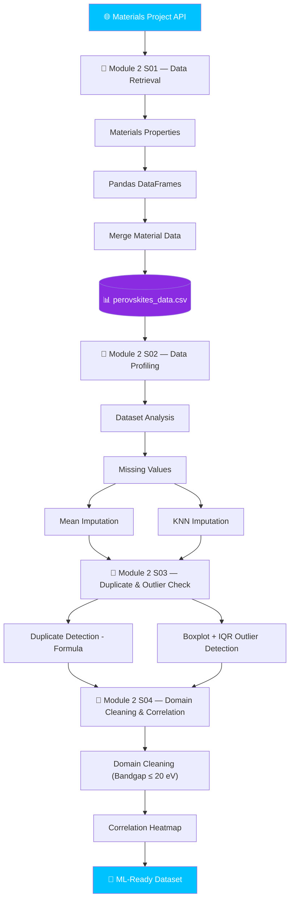
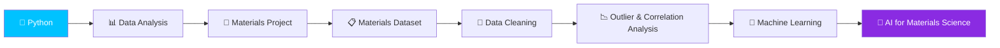

<div align="center">


<br/>

<a href="https://skillicons.dev">
  
</a>

<br/><br/>


<br/><br/>


<br/>

> 📚 Practical AI & Material Science notebooks for learning Python programming, data analysis, material properties, scientific visualization, Materials Project API, and machine-learning-ready data processing.


</div>


## 📂 Repository Structure

```text
📦 AI-Material-Science
 ├── 📁 Module_1
 │   ├── 📓 Module 1 S01.ipynb
 │   ├── 📓 Module 1 S02.ipynb
 │   ├── 📓 Module 1 S03.ipynb
 │   ├── 📓 Module 1 S04.ipynb
 │   ├── 📓 Module 1 S05.ipynb
 │   ├── 📓 Module 1 S06.ipynb
 │   ├── 📓 Module 1 S07.ipynb
 │   └── 📓 Module 1 S08.ipynb
 │
 ├── 📁 Module_2
 │   ├── 📓 Module 2 S01.ipynb
 │   ├── 📓 Module 2 S02.ipynb
 │   ├── 📓 Module 2 S03.ipynb
 │   └── 📓 Module 2 S04.ipynb
 │
 ├── 📄 perovskites_data.csv
 ├── 📄 perovskites_report.html
 └── 📄 README.md
```


## 📘 Notebook Overview

<div align="center">


# 🔵 Module 1 — Python & Material Science Fundamentals


</div>

<details open>
<summary><b>📓 Module 1 S01.ipynb — 🏗️ Material Properties using Python</b></summary>
<br>

✨ **Topics Covered**
`Dictionary Creation` · `Material Database` · `Atomic Number` · `Density` · `Material Properties` · `Python Basics` · `Data Storage`

🎯 **Learning Outcome**
✔ Learn how to organize engineering material data using Python dictionaries.
</details>

<details>
<summary><b>📓 Module 1 S02.ipynb — 📊 Material Data Processing</b></summary>
<br>

✨ **Topics Covered**
`NumPy` · `Arrays` · `Scientific Computation` · `Material Dataset Handling` · `Data Processing` · `Engineering Calculations`

🎯 **Learning Outcome**
✔ Understand numerical computing techniques used in Material Science.
</details>

<details>
<summary><b>📓 Module 1 S03.ipynb — 📈 Periodic Table Visualization</b></summary>
<br>

✨ **Topics Covered**
`Matplotlib` · `Transition Metals` · `Charts` · `Graphs` · `Scientific Visualization`

🎯 **Learning Outcome**
✔ Visualize engineering datasets with professional graphs.
</details>

<details>
<summary><b>📓 Module 1 S04.ipynb — 🔥 Thermal Conductivity Analysis</b></summary>
<br>

✨ **Topics Covered**
`Thermal Conductivity` · `Material Comparison` · `Bar Charts` · `Data Visualization`

🎯 **Learning Outcome**
✔ Compare thermal properties of different engineering materials visually.
</details>

<details>
<summary><b>📓 Module 1 S05.ipynb — 📋 Multi-Material Dataset</b></summary>
<br>

✨ **Topics Covered**
`Pandas DataFrame` · `Multiple Materials` · `Material Database` · `Engineering Data Analysis`

🎯 **Learning Outcome**
✔ Build and analyze structured material datasets.
</details>

<details>
<summary><b>📓 Module 1 S06.ipynb — 🤖 AI Workflow & Git Basics</b></summary>
<br>

✨ **Topics Covered**
`Pandas` · `Dataset Creation` · `Git Commands` · `Version Control` · `AI Project Workflow`

🎯 **Learning Outcome**
✔ Learn professional project management using Git with AI notebooks.
</details>

<details>
<summary><b>📓 Module 1 S07.ipynb — 🔑 Materials Project API Setup</b></summary>
<br>

✨ **Topics Covered**
`Materials Project API` · `API Key Configuration` · `MPRester Initialization` · `Environment Variables` · `.env Configuration`

🎯 **Learning Outcome**
✔ Learn how to configure and connect Python applications to the Materials Project API.
</details>

<details>
<summary><b>📓 Module 1 S08.ipynb — 🔥 Materials Data Retrieval and Visualization</b></summary>
<br>

✨ **Topics Covered**
`Materials Project API` · `Data Retrieval` · `Pandas DataFrame` · `Data Visualization`

🎯 **Learning Outcome**
✔ Learn how to retrieve materials data from the Materials Project API and visualize it using Python.
</details>

<br>

<div align="center">


# 🟣 Module 2 — Materials Data Engineering & Analysis


</div>

<details open>
<summary><b>📓 Module 2 S01.ipynb — 🔬 Materials Project Data Retrieval & Dataset Creation</b></summary>
<br>

✨ **Topics Covered**
`Materials Project API` · `MPRester` · `API Authentication` · `Perovskite Materials` · `Band Gap Data` · `Formation Energy` · `Lattice Volume` · `Pandas DataFrames` · `Data Merging` · `CSV Dataset Creation`

The notebook retrieves materials matching the required chemical formulas from the Materials Project and extracts properties including **Material ID, formula, band gap, formation energy per atom, and volume**.

The retrieved datasets are converted into Pandas DataFrames, merged using `Material_ID`, and exported as `perovskites_data.csv`.

🎯 **Learning Outcome**
✔ Learn how to retrieve real materials-science data from the Materials Project API.
✔ Understand how to convert API results into structured Pandas DataFrames.
✔ Learn how to merge material-property datasets.
✔ Create a reusable CSV dataset for further AI and machine-learning analysis.

**📊 Dataset Generated:** `perovskites_data.csv`

| Column             | Description                           |
| ------------------ | -------------------------------------- |
| `Material_ID`      | Materials Project material identifier |
| `Formula`          | Chemical formula                      |
| `Bandgap`          | Band gap value                        |
| `Formation_Energy` | Formation energy per atom             |
| `Volume`           | Material volume                       |
</details>

<details>
<summary><b>📓 Module 2 S02.ipynb — 🧹 Materials Dataset Profiling & Missing Value Imputation</b></summary>
<br>

✨ **Topics Covered**
`Pandas` · `Dataset Loading` · `Automated Data Profiling` · `ydata-profiling` · `Missing Data Analysis` · `Mean Imputation` · `KNN Imputation` · `Scikit-Learn` · `Data Preprocessing`

The notebook loads the `perovskites_data.csv` dataset generated in Session 09 and displays the first records, then creates an automated profiling report saved as `perovskites_report.html`.

```text
Mean Imputation  →  SimpleImputer(strategy="mean")
KNN Imputation   →  KNNImputer(n_neighbors=5)
```

Both approaches are applied to the `Bandgap` column.

🎯 **Learning Outcome**
✔ Inspect a scientific dataset automatically.
✔ Generate an HTML data-profiling report.
✔ Understand missing-value problems in material datasets.
✔ Apply Mean Imputation and KNN Imputation.
✔ Prepare datasets for future machine-learning workflows.

**📄 Report Generated:** `perovskites_report.html`
</details>

<details>
<summary><b>📓 Module 2 S03.ipynb — 🧪 Duplicate & Outlier Detection in Materials Data</b></summary>
<br>

✨ **Topics Covered**
`Pandas` · `Seaborn` · `Duplicate Detection` · `Boxplot Visualization` · `Statistical Outlier Detection` · `IQR Method` · `Data Quality Assessment`

The notebook (Session 11) reloads the cleaned `perovskites_data.csv` dataset and inspects it for data-quality issues.

It first detects **duplicate entries** based on the `Formula` column using `df.duplicated()`, then visualizes the distribution of the `Bandgap` column with a **Seaborn boxplot** to spot anomalies visually. Finally, it applies the **IQR method** — computing Q1, Q3, and IQR — to mathematically flag statistical outliers in `Bandgap`.

```text
Duplicate Detection (Formula) → Boxplot (Bandgap) → IQR Bounds → Flagged Outliers
```

🎯 **Learning Outcome**
✔ Detect duplicate records in a materials dataset.
✔ Visualize numerical distributions using Seaborn boxplots.
✔ Understand and apply the IQR method for outlier detection.
✔ Combine visual and statistical techniques for data-quality assessment.
</details>

<details>
<summary><b>📓 Module 2 S04.ipynb — 📉 Domain-Driven Cleaning & Correlation Analysis</b></summary>
<br>

✨ **Topics Covered**
`Pandas` · `Seaborn` · `Matplotlib` · `Domain-Driven Data Cleaning` · `Physical Plausibility Filtering` · `Correlation Heatmap` · `Feature Relationships`

The notebook (Session 12) reloads `perovskites_data.csv` and applies **domain-driven cleaning**, filtering out physically implausible band gap values (> 20 eV) to produce a cleaned `df_clean`. It then selects numeric columns (`Bandgap`, `Formation_Energy`, `Volume`) and generates a **correlation heatmap** with Seaborn.

```text
perovskites_data.csv → Domain Cleaning (Bandgap ≤ 20 eV) → df_clean → Correlation Heatmap
```

🎯 **Learning Outcome**
✔ Apply domain knowledge to filter physically implausible data.
✔ Build a cleaned, analysis-ready DataFrame (`df_clean`).
✔ Generate and interpret a correlation heatmap of materials properties.
✔ Understand relationships between band gap, formation energy, and volume.
</details>


## 🛠 Technologies Used

<div align="center">

| Technology               | Purpose                          |
| ------------------------ | --------------------------------- |
| 🐍 Python                | Programming                      |
| 📊 Pandas                | Data Analysis                    |
| 🔢 NumPy                 | Numerical Computing              |
| 📈 Matplotlib            | Visualization                    |
| 🎨 Seaborn               | Statistical Visualization        |
| 📒 Jupyter Notebook      | Interactive Coding               |
| 🌐 Materials Project API | Materials Data Retrieval         |
| 🔬 MPRester              | Materials Project Python Client  |
| 🤖 Scikit-Learn          | Data Preprocessing               |
| 📋 ydata-profiling       | Automated Dataset Profiling      |
| 🌳 Git                   | Version Control                  |

</div>


## 🎯 Learning Objectives & Progress

<div align="center">

**Module 1 — Fundamentals**


**Module 2 — Data Engineering & Analysis**


**Module 3 — Machine Learning** *(coming soon)*


</div>

### Module 1
✅ Python Programming &nbsp; ✅ Material Property Analysis &nbsp; ✅ Engineering Data Handling &nbsp; ✅ Scientific Visualization &nbsp; ✅ Dataset Management

### Module 2
✅ Materials Project API · ✅ Real Materials Dataset Retrieval · ✅ Perovskite Data Analysis · ✅ Pandas DataFrame Operations · ✅ Dataset Merging · ✅ CSV Dataset Creation · ✅ Automated Data Profiling · ✅ Missing Value Handling · ✅ Mean Imputation · ✅ KNN Imputation · ✅ Duplicate Detection · ✅ Statistical & Visual Outlier Detection (Boxplot, IQR) · ✅ Domain-Driven Data Cleaning · ✅ Correlation Analysis & Heatmaps · ✅ AI/ML-ready Data Preparation


## 🚀 Getting Started

**1️⃣ Clone the Repository**
```bash
git clone <repository-url>
```

**2️⃣ Enter the Repository**
```bash
cd AI-Material-Science
```

**3️⃣ Install Required Libraries**
```bash
pip install pandas numpy matplotlib jupyter
```

For Module 2:
```bash
pip install mp-api python-dotenv scikit-learn ydata-profiling seaborn
```

**4️⃣ Start Jupyter Notebook**
```bash
jupyter notebook
```

Open the notebooks and execute the cells one by one. 🎉


## 🔬 Module 2 Workflow




## 📁 Generated Files

```text
📦 Module_2
 ├── 📓 Module 2 S01.ipynb
 ├── 📓 Module 2 S02.ipynb
 ├── 📓 Module 2 S03.ipynb
 ├── 📓 Module 2 S04.ipynb
 ├── 📊 perovskites_data.csv
 └── 📄 perovskites_report.html
```


## 🌟 Skills You'll Gain

<div align="center">

`Python Programming` `Pandas Data Analysis` `NumPy Scientific Computing` `Material Science Data Handling` `Materials Project API` `API-Based Data Retrieval` `Perovskite Dataset Creation` `Scientific Visualization` `Dataset Profiling` `Missing Data Handling` `Mean Imputation` `KNN Imputation` `Duplicate & Outlier Detection` `IQR Statistical Analysis` `Domain-Driven Data Cleaning` `Correlation Heatmap Analysis` `Machine Learning Data Preparation` `Git & GitHub Workflow` `Jupyter Notebook Usage`

</div>


## 📚 Course Modules

| Module       | Topic                                        | Status |
| ------------ | --------------------------------------------- | :----: |
| Module 1 S01 | Material Properties                          | ✅ |
| Module 1 S02 | Data Processing                              | ✅ |
| Module 1 S03 | Visualization                                | ✅ |
| Module 1 S04 | Thermal Analysis                             | ✅ |
| Module 1 S05 | Material Dataset                             | ✅ |
| Module 1 S06 | AI Workflow & Git                            | ✅ |
| Module 1 S07 | Materials Project API                        | ✅ |
| Module 1 S08 | Materials Data Visualization                 | ✅ |
| Module 2 S01 | Materials Data Retrieval & Dataset Creation  | ✅ |
| Module 2 S02 | Data Profiling & Missing Value Imputation    | ✅ |
| Module 2 S03 | Duplicate & Outlier Detection                | ✅ |
| Module 2 S04 | Domain-Driven Cleaning & Correlation         | ✅ |


## 🔮 Future Modules

<table align="center">
<tr>
<td valign="top">

**Module 3**
- Machine Learning for Materials
- Feature Engineering
- Regression Models
- Classification
- Model Evaluation

</td>
<td valign="top">

**Module 4**
- Materials Property Prediction
- Random Forest
- XGBoost
- Neural Networks
- AI-Based Materials Discovery

</td>
</tr>
</table>


## ⭐ Repository Highlights



<div align="center">

<br>

## ⭐ If you found this repository useful, don't forget to Star it!


### Happy Learning 🚀

### 🧪 AI • Materials • Data • Python • Machine Learning

**Made with 💙 by Murari Singh**


</div>
