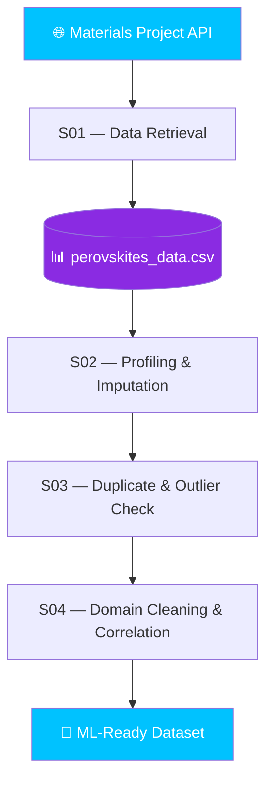

<div align="center">


<br/>


<br/><br/>


<br/><br/>


<br/><br/>

> 📚 Practical AI & Material Science notebooks for learning Python, data analysis, material properties, scientific visualization, and the Materials Project API.

</div>


## 📂 Repository Structure

```text
📦 AI-Material-Science
 ├── 📁 Module_1
 │   ├── 📓 Module 1 S01.ipynb
 │   ├── 📓 Module 1 S02.ipynb
 │   ├── 📓 Module 1 S03.ipynb
 │   ├── 📓 Module 1 S04.ipynb
 │   ├── 📓 Module 1 S05.ipynb
 │   ├── 📓 Module 1 S06.ipynb
 │   ├── 📓 Module 1 S07.ipynb
 │   └── 📓 Module 1 S08.ipynb
 │
 ├── 📁 Module_2
 │   ├── 📓 Module 2 S01.ipynb
 │   ├── 📓 Module 2 S02.ipynb
 │   ├── 📓 Module 2 S03.ipynb
 │   └── 📓 Module 2 S04.ipynb
 │
 ├── 📄 perovskites_data.csv
 ├── 📄 perovskites_report.html
 └── 📄 README.md
```


## 📘 Notebook Overview

### 🔵 Module 1 — Python & Material Science Fundamentals


<details open>
<summary><b>📓 S01 — 🏗️ Material Properties using Python</b></summary>
<br>

**Topics:** Dictionary Creation • Material Database • Atomic Number • Density • Python Basics

**Outcome:** Learn how to organize engineering material data using Python dictionaries.
</details>

<details>
<summary><b>📓 S02 — 📊 Material Data Processing</b></summary>
<br>

**Topics:** NumPy • Arrays • Scientific Computation • Engineering Calculations

**Outcome:** Understand numerical computing techniques used in Material Science.
</details>

<details>
<summary><b>📓 S03 — 📈 Periodic Table Visualization</b></summary>
<br>

**Topics:** Matplotlib • Transition Metals • Charts • Scientific Visualization

**Outcome:** Visualize engineering datasets with professional graphs.
</details>

<details>
<summary><b>📓 S04 — 🔥 Thermal Conductivity Analysis</b></summary>
<br>

**Topics:** Thermal Conductivity • Material Comparison • Bar Charts

**Outcome:** Compare thermal properties of different engineering materials visually.
</details>

<details>
<summary><b>📓 S05 — 📋 Multi-Material Dataset</b></summary>
<br>

**Topics:** Pandas DataFrame • Multiple Materials • Engineering Data Analysis

**Outcome:** Build and analyze structured material datasets.
</details>

<details>
<summary><b>📓 S06 — 🤖 AI Workflow & Git Basics</b></summary>
<br>

**Topics:** Pandas • Dataset Creation • Git Commands • Version Control

**Outcome:** Learn professional project management using Git with AI notebooks.
</details>

<details>
<summary><b>📓 S07 — 🔑 Materials Project API Setup</b></summary>
<br>

**Topics:** Materials Project API • API Key Configuration • MPRester • .env Configuration

**Outcome:** Learn how to configure and connect Python applications to the Materials Project API.
</details>

<details>
<summary><b>📓 S08 — 🔥 Materials Data Retrieval and Visualization</b></summary>
<br>

**Topics:** Materials Project API • Data Retrieval • Pandas DataFrame • Visualization

**Outcome:** Learn how to retrieve materials data from the API and visualize it using Python.
</details>

<br>

### 🟣 Module 2 — Materials Data Engineering & Analysis


<details open>
<summary><b>📓 S01 — 🔬 Materials Project Data Retrieval & Dataset Creation</b></summary>
<br>

Retrieves materials matching the required chemical formulas from the Materials Project and extracts **Material ID, formula, band gap, formation energy, and volume**. Data is merged on `Material_ID` and exported as `perovskites_data.csv`.

**📊 Dataset Generated:** `perovskites_data.csv`

| Column             | Description                           |
| ------------------ | -------------------------------------- |
| `Material_ID`      | Materials Project material identifier |
| `Formula`          | Chemical formula                      |
| `Bandgap`          | Band gap value                        |
| `Formation_Energy` | Formation energy per atom             |
| `Volume`           | Material volume                       |

**Outcome:** Retrieve real materials-science data, structure it into DataFrames, and build a reusable dataset for ML.
</details>

<details>
<summary><b>📓 S02 — 🧹 Dataset Profiling & Missing Value Imputation</b></summary>
<br>

Loads `perovskites_data.csv`, generates an automated profiling report (`perovskites_report.html`), and handles missing values in the `Bandgap` column:

```text
Mean Imputation  →  SimpleImputer(strategy="mean")
KNN Imputation   →  KNNImputer(n_neighbors=5)
```

**Outcome:** Understand and fix missing-value problems using Mean and KNN Imputation.
</details>

<details>
<summary><b>📓 S03 — 🧪 Duplicate & Outlier Detection</b></summary>
<br>

Detects duplicate entries by `Formula`, visualizes `Bandgap` with a Seaborn boxplot, then applies the **IQR method** to flag statistical outliers.

```text
Duplicate Detection → Boxplot → IQR Bounds → Flagged Outliers
```

**Outcome:** Combine visual and statistical techniques for data-quality assessment.
</details>

<details>
<summary><b>📓 S04 — 📉 Domain-Driven Cleaning & Correlation Analysis</b></summary>
<br>

Filters out physically implausible band gap values (> 20 eV) to produce `df_clean`, then generates a **correlation heatmap** across `Bandgap`, `Formation_Energy`, and `Volume`.

```text
perovskites_data.csv → Domain Cleaning (Bandgap ≤ 20 eV) → df_clean → Correlation Heatmap
```

**Outcome:** Apply domain knowledge to clean data and understand feature relationships.
</details>


## 🛠 Technologies Used

| Technology               | Purpose                          |
| ------------------------ | --------------------------------- |
| 🐍 Python                | Programming                      |
| 📊 Pandas                | Data Analysis                    |
| 🔢 NumPy                 | Numerical Computing              |
| 📈 Matplotlib / Seaborn  | Visualization                    |
| 📒 Jupyter Notebook      | Interactive Coding               |
| 🌐 Materials Project API | Materials Data Retrieval         |
| 🤖 Scikit-Learn          | Data Preprocessing               |
| 📋 ydata-profiling       | Automated Dataset Profiling      |
| 🌳 Git                   | Version Control                  |


## 🎯 Progress

**Module 1 — Fundamentals**


**Module 2 — Data Engineering & Analysis**


## 🚀 Getting Started

**1️⃣ Clone the Repository**
```bash
git clone <repository-url>
```

**2️⃣ Enter the Repository**
```bash
cd AI-Material-Science
```

**3️⃣ Install Required Libraries**
```bash
pip install pandas numpy matplotlib jupyter
```

For Module 2:
```bash
pip install mp-api python-dotenv scikit-learn ydata-profiling seaborn
```

**4️⃣ Start Jupyter Notebook**
```bash
jupyter notebook
```


## 🔬 Module 2 Workflow




## 📚 Course Modules

| Module       | Topic                                        | Status |
| ------------ | --------------------------------------------- | :----: |
| Module 1 S01 | Material Properties                          | ✅ |
| Module 1 S02 | Data Processing                              | ✅ |
| Module 1 S03 | Visualization                                | ✅ |
| Module 1 S04 | Thermal Analysis                             | ✅ |
| Module 1 S05 | Material Dataset                             | ✅ |
| Module 1 S06 | AI Workflow & Git                            | ✅ |
| Module 1 S07 | Materials Project API                        | ✅ |
| Module 1 S08 | Materials Data Visualization                 | ✅ |
| Module 2 S01 | Data Retrieval & Dataset Creation            | ✅ |
| Module 2 S02 | Data Profiling & Missing Value Imputation    | ✅ |
| Module 2 S03 | Duplicate & Outlier Detection                | ✅ |
| Module 2 S04 | Domain-Driven Cleaning & Correlation         | ✅ |


## 🌟 Skills You'll Gain

`Python` `Pandas` `NumPy` `Materials Project API` `Perovskite Dataset Creation` `Data Visualization` `Data Profiling` `Missing Value Imputation` `Outlier Detection (IQR)` `Domain-Driven Data Cleaning` `Correlation Analysis` `Git & GitHub`


<div align="center">

## ⭐ If you found this repository useful, don't forget to Star it!

### Happy Learning 🚀

**Made with 💙 by Murari Singh**


</div>
